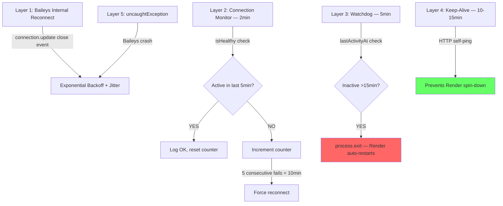

# GregAI Webservice — Architecture & Operations

## Overview

GregAI is a multi-platform AI chatbot deployed on [Render.com](https://dashboard.render.com) (free tier). It receives messages from **WhatsApp** and **Signal**, routes them through an LLM via the **Kilo Code API**, and sends responses back natively.

```mermaid
graph LR
    WA[WhatsApp] -->|Baileys WS| NC[Node.js Router]
    SIG[Signal] -->|signal-cli TCP| NC
    NC -->|HTTP| KILO[Kilo Code API Gateway]
    KILO -->|OpenRouter| LLM[Various LLMs]
    NC -->|Express| HEALTH[/health endpoint]
    HEALTH -->|Self-ping 10-15min| HEALTH
```

## Tech Stack

| Component | Technology | Purpose |
|-----------|-----------|---------|
| Runtime | Node.js v24 | Application server |
| WhatsApp | `@whiskeysockets/baileys` v7 | Multi-device WA client |
| Signal | `signal-cli` (native binary) | Signal messaging via JSON-RPC over TCP |
| LLM Gateway | Kilo Code API (`api.kilo.ai`) | Routes to free-tier LLMs |
| HTTP Server | Express v5 | Health checks, Render keep-alive |
| Deployment | Docker on Render.com (free tier) | Container hosting |
| Source Control | GitHub (`gregorvanwaning-cmyk/GregAI-Webservice`) | Auto-deploy on push |

## File Structure

```
src/
├── index.js            — Bootstrap, HTTP server, monitors, watchdog, error handlers
├── whatsapp_client.js  — Baileys socket management, reconnect logic
├── signal_client.js    — signal-cli JSON-RPC TCP client
├── command_parser.js   — Slash command handler + LLM routing
├── kilo_api.js         — Kilo Code API client (models list, chat completions)
└── memory_manager.js   — Per-chat conversation history (50 msg, 48h TTL)
scripts/
├── start.sh            — Docker entrypoint (cron, signal-cli daemon, node)
├── fetch_logs.js       — Render API log fetcher
└── maintenance.sh      — Cron maintenance tasks
```

## Chat Commands

| Command | Description |
|---------|-------------|
| `/help` | Show all available commands |
| `/models` | List available free-tier LLMs |
| `/model/[N]` | Switch to model #N from the list  |
| `/systemprompt` | Display the current system prompt |
| `/systemprompt/[text]` | Set a new system prompt (preserves casing) |
| `/sleep` | Ignore all messages (except `/wakeup`, `/help`, `/restart`) |
| `/wakeup` | Resume normal operation |
| `/restart` | Restart the service (admin only) |

## Stability Architecture

### Problem History & Fixes

Four distinct stability issues were identified and resolved over multiple debugging rounds:

#### 1. Baileys Crypto Crash
- **Symptom:** Process crashed after ~7 min with `Error: Unsupported state or unable to authenticate data`
- **Cause:** Baileys threw an unhandled async crypto error during message decryption
- **Fix:** Global `uncaughtException` handler in `index.js` catches Baileys errors by stack trace and triggers a graceful reconnect instead of crashing

#### 2. Reconnect Storm (Code 440/503)
- **Symptom:** Endless rapid-fire reconnect loop, dozens per minute
- **Cause:** Hard-coded 2-second reconnect delay caused WhatsApp rate limiting
- **Fix:** Exponential backoff with jitter (5s → 10s → 20s → 40s → 60s max). All reconnection centralised through a single `reconnect()` entry point with timer guards to prevent duplicate socket creation

#### 3. Monitor Destroying Working Connections
- **Symptom:** Service dies silently after 10-20 min despite messages flowing normally
- **Cause:** Connection monitor checked `ws.readyState === 1` every 2min. Baileys' internal WS state is **unreliable** — it reports "not open" even during active message flow. After 3 false-positive "dead" checks, the monitor forcefully rebuilt the socket, corrupting the Baileys crypto session
- **Fix:** Replaced `isConnected()` (ws.readyState) with `isHealthy()` (activity-based: checks if any message was sent/received in the last 5 minutes). Monitor now waits 10 min (5 checks) of true inactivity before intervening

#### 4. Render Free Tier Spin-Down (The TRUE Root Cause)
- **Symptom:** Service stops responding after ~15 min with no crash, no error, logs just stop
- **Cause:** Render's free tier **kills containers** after ~15 min of no inbound HTTP requests. WebSocket (WhatsApp) and TCP (Signal) traffic does NOT count as HTTP activity
- **Fix:** Self-ping keep-alive hits the service's own `/health` endpoint at randomised 10-15 min intervals via HTTP, preventing Render from spinning down the container

### Safety Layers (Defense in Depth)



| Layer | Interval | Purpose |
|-------|----------|---------|
| Baileys internal | Immediate | Handles normal disconnects via `connection.update` |
| Connection Monitor | Every 2 min | Detects prolonged inactivity, forces reconnect after 10 min |
| Self-Healing Watchdog | Every 5 min | Restarts process after 15 min of total inactivity |
| Keep-Alive Self-Ping | Every 10-15 min (random) | Prevents Render free tier from killing the container |
| uncaughtException | On error | Catches Baileys crypto crashes, reconnects gracefully |
| unhandledRejection | On error | Logs rejected promises without crashing |

### Key Design Decisions

1. **Activity-based health, not WebSocket state.** Baileys' `ws.readyState` is unreliable. We track `lastActivityAt` across three events: connection open, message received, message sent.

2. **Monitor observes, doesn't destroy.** The connection monitor only logs status and counts consecutive inactive checks. It never tears down a working socket.

3. **Centralised reconnection.** All reconnect paths (monitor, watchdog, Baileys events, uncaughtException) go through `WhatsAppClient.reconnect()` which enforces the `isReconnecting` lock and timer guards.

4. **Randomised keep-alive.** The self-ping interval is randomised between 10-15 minutes using recursive `setTimeout` to create organic-looking HTTP traffic patterns.

## Environment Variables

| Variable | Value | Notes |
|----------|-------|-------|
| `PORT` | `3000` | HTTP server port |
| `NODE_ENV` | `production` | |
| `SIGNAL_PHONE` | `+31649649017` | Signal account number |
| `SIGNAL_URL` | `http://127.0.0.1:8080` | signal-cli TCP endpoint |
| `RENDER_EXTERNAL_URL` | `https://gregai-webservice.onrender.com` | Used by self-ping keep-alive |
| `KILO_API_KEY` | *(secret)* | Set in Render dashboard |
| `WHATSAPP_PHONE` | *(optional)* | For pairing code auth |

## Deployment

Push to `main` branch on GitHub → Render auto-deploys via Dockerfile.

```bash
git add . && git commit -m "description" && git push
```

Health check: `curl https://gregai-webservice.onrender.com/health`
